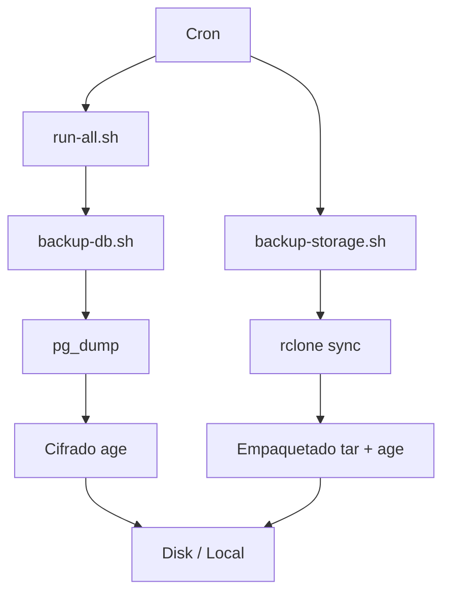

# Supabase Backups (DB + Storage S3)

<div align="center">


**Sistema auto-contenible para realizar copias de seguridad robustas de proyectos Supabase en un VPS Linux.**

[Características](#características-principales) • [Requisitos](#requisitos) • [Estructura](#estructura-del-proyecto) • [Instalación](#configuración) • [Uso](#uso) • [Restauración](#restauración)

</div>

---

## 📋 Características Principales

Este repositorio implementa un sistema completo de backups para Supabase:

- 🗄️ **Base de Datos**: Backup completo de PostgreSQL usando `pg_dump`.
- 📦 **Storage**: Sincronización incremental usando S3 compatible + `rclone`.
- 🔐 **Seguridad**: Cifrado fuerte de todos los backups localmente usando `age`.
- 🧹 **Gestión Automática**: Rotación y limpieza de backups antiguos.
- 🏗️ **Multi-proyecto**: Soporte para múltiples entornos/proyectos en el mismo servidor.
- 🚨 **Alertas**: Notificaciones opcionales vía Telegram.

## ⚠️ Aclaraciones Importantes

> [!IMPORTANT]
> **Endpoint S3 Correcto**:
> Según la documentación oficial, usa siempre este formato: `https://<project-ref>.storage.supabase.co`
>
> ❌ **NO usar**: `https://<project-ref>.supabase.co/storage/v1/s3`

> [!NOTE]
> **Orquestación**:
> - `run-all.sh`: Orquesta **SOLO** backups de Base de Datos.
> - `backup-storage.sh`: Se ejecuta independientemente por proyecto (debido a duración y recursos).

## 🛠 Requisitos

### Debian / Ubuntu
```bash
sudo apt update
sudo apt install -y postgresql-client rclone age tar
```

### macOS
```bash
brew install libpq rclone age gnu-tar
# Nota: macOS usa bsdtar por defecto. gnu-tar es recomendado para compatibilidad total con scripts Linux.
# libpq incluye pg_dump
```

## 📂 Estructura del Proyecto



```text
supabase-backups/
├── bin/
│   ├── run-all.sh              # Orquestador DB (Todos los proyectos)
│   ├── backup-db.sh            # Script backup DB individual
│   ├── backup-storage.sh       # Script backup Storage individual
│   ├── rotate-backup.sh        # Rotación de logs/backups
│   └── alert.sh                # Sistema de alertas
├── config/
│   ├── global.env              # Configuración compartida
│   ├── backup.pub              # Clave pública para cifrado
│   └── projects/               # Configs por proyecto
│       └── demo.env
├── backups/                    # Destino de backups
└── logs/                       # Logs de ejecución
```

## ⚙️ Configuración

### 1. Configuración Global (`config/global.env`)

Copia la plantilla y edítala con tus rutas base:

```bash
cp config/global.env.example config/global.env
nano config/global.env
```

### 2. Configuración por Proyecto (`config/projects/`)

Crea un archivo por cada proyecto basado en la plantilla:

```bash
cp config/projects/project.env.example config/projects/mi-proyecto.env
nano config/projects/mi-proyecto.env
```

Configuración pura. Define solo credenciales e identificadores.

```bash
export PROJECT_NAME="Demo"
# ... (ver plantilla)
```

### 3. Cifrado (`age`)

Genera las claves. **Guarda `backup.key` en un lugar seguro (fuera del servidor)**.

```bash
age-keygen -o backup.key
grep public backup.key > config/backup.pub
chmod 600 backup.key config/backup.pub
```

### 4. Rclone (`~/.config/rclone/rclone.conf`)

Configuración mínima para el provider S3 genérico.

```ini
[supabase-s3]
type = s3
provider = Other
env_auth = true
region = us-east-1
acl = private
```

## 🚀 Uso

### Ejecución Manual

| Acción | Comando |
|--------|---------|
| **Backup DB (Todos)** | `bin/run-all.sh --db` |
| **Backup Storage (Inc.)** | `bin/run-all.sh --storage --incremental` |
| **Backup Storage (Full)** | `bin/run-all.sh --storage --full` |
| **Backup Todo (Todos)** | `bin/run-all.sh --all` |
| **Backup DB (Uno)** | `export SUPABASE_BACKUP_ENV=config/projects/demo.env && bin/backup-db.sh` |
| **Backup Storage (Uno)** | `export SUPABASE_BACKUP_ENV=config/projects/demo.env && bin/backup-storage.sh --full` |

### Automatización (Cron)

Ejemplos recomendados para `/etc/crontab` o `crontab -e`:

```cron
# DB diario a las 02:00
0 2 * * * cd /root/supabase-backups && bin/run-all.sh --db >> logs/cron-db.log 2>&1

# Storage semanal (Domingos 03:00)
0 3 * * 0 cd /root/supabase-backups && bin/run-all.sh --storage >> logs/cron-storage.log 2>&1

# Limpieza diaria (04:30)
30 4 * * * cd /root/supabase-backups && bin/rotate-backup.sh >> logs/cron-rotate.log 2>&1
```

## 🔄 Restauración

Para restaurar los backups cifrados, necesitas tu clave privada (`backup.key`).

### Base de Datos

```bash
age -d -i backup.key demo_db_YYYY-MM-DD.sql.gz.age | gunzip | psql -h ...
```

### Storage

```bash
# 1. Descifrar y descomprimir
age -d -i backup.key Demo_storage_YYYY-MM-DD.tar.gz.age | tar -xz

# 2. Restaurar con rclone (cuidado, esto sobrescribe)
rclone sync data/ supabase-s3:bucket-name
```
