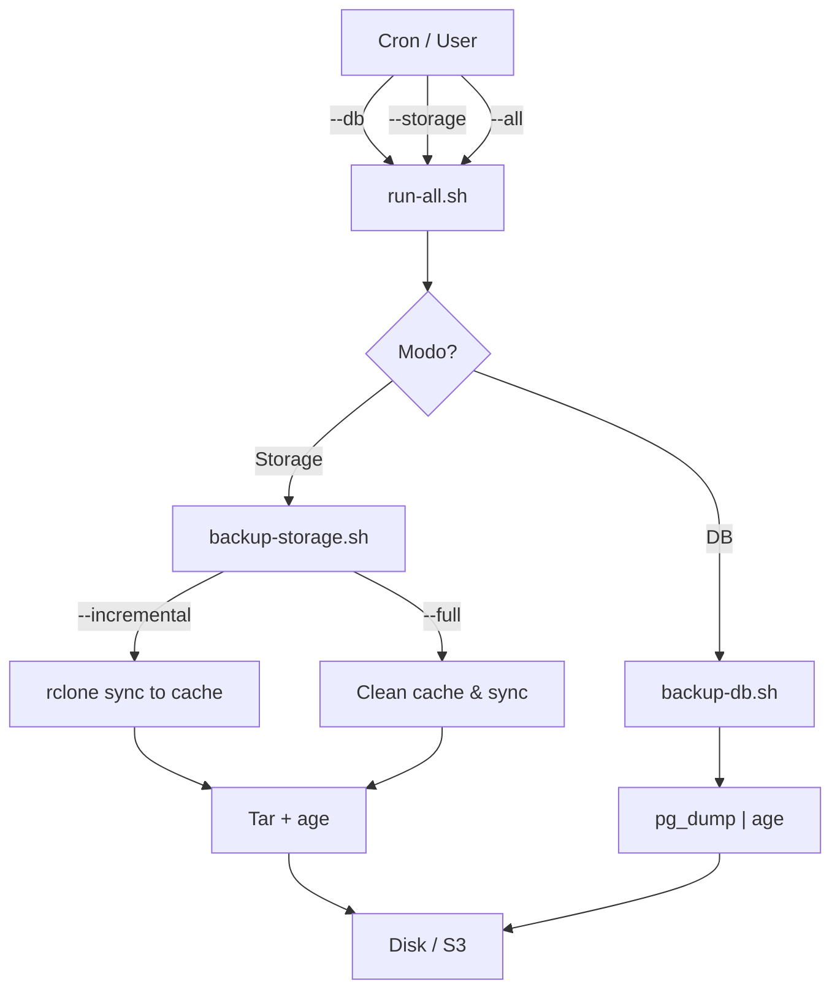

# Supabase Backups (DB + Storage S3)

<div align="center">


**Sistema auto-contenible para realizar copias de seguridad robustas de proyectos Supabase en un VPS Linux.**

[Características](#características-principales) • [Requisitos](#requisitos) • [Estructura](#estructura-del-proyecto) • [Instalación](#configuración) • [Uso](#uso) • [Restauración](#restauración)

</div>

---

## 📋 Características Principales

Este repositorio implementa un sistema completo de backups para Supabase:

- 🗄️ **Base de Datos**: Backup completo de PostgreSQL usando `pg_dump`.
- 📦 **Storage**: Sincronización incremental usando S3 compatible + `rclone`.
- 🔐 **Seguridad**: Cifrado fuerte de todos los backups localmente usando `age`.
- 🧹 **Gestión Automática**: Rotación y limpieza de backups antiguos.
- 🏗️ **Multi-proyecto**: Soporte para múltiples entornos/proyectos en el mismo servidor.
- 🚨 **Alertas**: Notificaciones opcionales vía Telegram.

## ⚠️ Aclaraciones Importantes

> [!IMPORTANT]
> **Endpoint S3 Correcto**:
> Según la documentación oficial, usa siempre este formato: `https://<project-ref>.storage.supabase.co`
>
> ❌ **NO usar**: `https://<project-ref>.supabase.co/storage/v1/s3`

> [!NOTE]
> **Orquestación**:
> - `run-all.sh`: Orquesta **SOLO** backups de Base de Datos.
> - `backup-storage.sh`: Se ejecuta independientemente por proyecto (debido a duración y recursos).

## 🛠 Requisitos

### Debian / Ubuntu
```bash
sudo apt update
sudo apt install -y postgresql-client rclone age tar
```

### macOS
```bash
brew install libpq rclone age gnu-tar
# Nota: macOS usa bsdtar por defecto. gnu-tar es recomendado para compatibilidad total con scripts Linux.
# libpq incluye pg_dump
```

## 📂 Estructura del Proyecto



```text
supabase-backups/
├── bin/
│   ├── run-all.sh              # Orquestador DB (Todos los proyectos)
│   ├── backup-db.sh            # Script backup DB individual
│   ├── backup-storage.sh       # Script backup Storage individual
│   ├── rotate-backup.sh        # Rotación de logs/backups
│   └── alert.sh                # Sistema de alertas
├── config/
│   ├── global.env              # Configuración compartida
│   ├── backup.pub              # Clave pública para cifrado
│   └── projects/               # Configs por proyecto
│       └── demo.env
├── backups/                    # Destino de backups
└── logs/                       # Logs de ejecución
```

## ⚙️ Configuración

### 1. Configuración Global (`config/global.env`)

Copia la plantilla y edítala con tus rutas base:

```bash
cp config/global.env.example config/global.env
nano config/global.env
```

### 2. Configuración por Proyecto (`config/projects/`)

Crea un archivo por cada proyecto basado en la plantilla:

```bash
cp config/projects/project.env.example config/projects/mi-proyecto.env
nano config/projects/mi-proyecto.env
```

Configuración pura. Define solo credenciales e identificadores.

```bash
export PROJECT_NAME="Demo"
# ... (ver plantilla)
```

### 3. Cifrado (`age`)

Genera las claves. **Guarda `backup.key` en un lugar seguro (fuera del servidor)**.

```bash
age-keygen -o backup.key
grep public backup.key > config/backup.pub
chmod 600 backup.key config/backup.pub
```

### 4. Rclone (`~/.config/rclone/rclone.conf`)

Configuración mínima para el provider S3 genérico.

```ini
[supabase-s3]
type = s3
provider = Other
env_auth = true
region = us-east-1
acl = private
```

### 5. Monitorización (Healthchecks.io)

El sistema soporta integración nativa con Healthchecks.io (o compatible) para detectar fallos silenciosos ("Dead Man's Switch").

1. Crea un check en Healthchecks.io.
2. Añade la URL en tu configuración (`global.env` o por proyecto):

```bash
export HEALTHCHECK_URL="https://hc-ping.com/tu-uuid"
```

El script enviará pings automáticos:
- `/start` al iniciar.
- `/fail` en caso de error.
- `OK` al finalizar correctamente.

## 🚀 Uso

### Ejecución Manual

| Acción | Comando |
|--------|---------|
| **Backup DB (Todos)** | `bin/run-all.sh --db` |
| **Backup Storage (Inc.)** | `bin/run-all.sh --storage --incremental` |
| **Backup Storage (Full)** | `bin/run-all.sh --storage --full` |
| **Backup Todo (Todos)** | `bin/run-all.sh --all` |
| **Backup DB (Uno)** | `export SUPABASE_BACKUP_ENV=config/projects/demo.env && bin/backup-db.sh` |
| **Backup Storage (Uno)** | `export SUPABASE_BACKUP_ENV=config/projects/demo.env && bin/backup-storage.sh --full` |

### Automatización (Cron)

Ejemplos recomendados para `/etc/crontab` o `crontab -e`:

```cron
# DB diario a las 02:00
0 2 * * * cd /root/supabase-backups && bin/run-all.sh --db >> logs/cron-db.log 2>&1

# Storage semanal (Domingos 03:00)
0 3 * * 0 cd /root/supabase-backups && bin/run-all.sh --storage >> logs/cron-storage.log 2>&1

# Limpieza diaria (04:30)
30 4 * * * cd /root/supabase-backups && bin/rotate-backup.sh >> logs/cron-rotate.log 2>&1
```

## 🔄 Restauración

Para restaurar los backups cifrados, necesitas tu clave privada (`backup.key`).

### Base de Datos

```bash
age -d -i backup.key demo_db_YYYY-MM-DD.sql.gz.age | gunzip | psql -h ...
```

### Storage

```bash
# 1. Descifrar y descomprimir
age -d -i backup.key Demo_storage_YYYY-MM-DD.tar.gz.age | tar -xz

# 2. Restaurar con rclone (cuidado, esto sobrescribe)
rclone sync data/ supabase-s3:bucket-name
```
